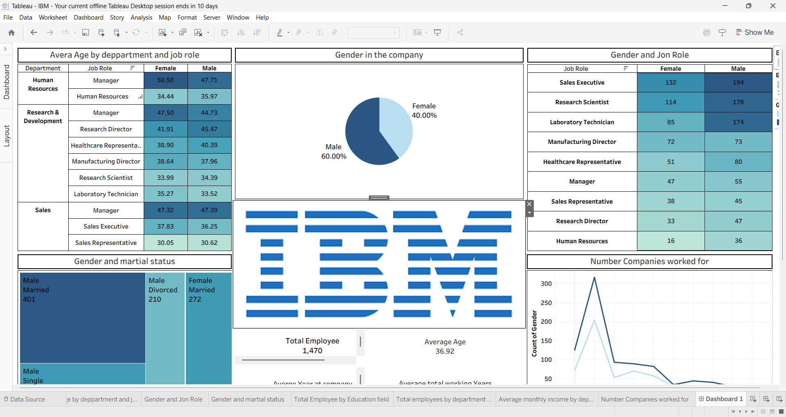
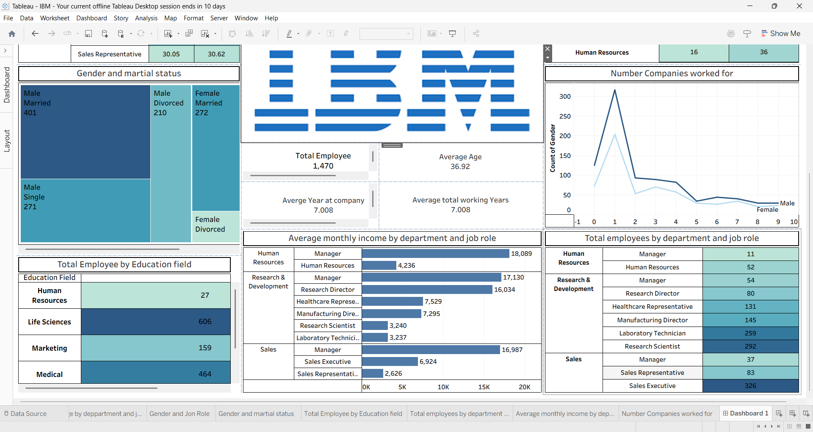

# IBM Employee Demographics Dashboard

## Overview
This project presents an interactive **Tableau dashboard** analyzing employee demographics, departmental composition, and salary distribution within IBM. It demonstrates data visualization, storytelling, and HR analytics skills using Tableau Desktop.

## Objectives
- Visualize workforce demographics — gender, age, marital status, and education field.  
- Analyze departmental structure — job roles and employee counts across departments.  
- Compare income levels — average monthly income by department and role.  
- Explore career patterns — number of companies worked for and average years at IBM.  

## Key Insights
| Metric | Value | Description |
|--------|-------|-------------|
| **Total Employees** | 1,470 | Workforce size analyzed |
| **Average Age** | 36.92 years | Mid-career employee base |
| **Average Tenure** | 7 years | Indicates moderate retention |
| **Gender Ratio** | 60% Male / 40% Female | Balanced but slightly male-dominant |
| **Top Education Field** | Life Sciences (606 employees) | Largest contributor to workforce |
| **Highest Income Role** | HR Manager – 18,089 | Leadership roles yield top pay |

## Dashboard Sections
- **Average Age by Department and Job Role**  
  Displays gender-based age averages across departments.  

- **Gender in the Company**  
  Pie chart showing male vs. female proportions.  

- **Gender and Marital Status**  
  Treemap illustrating relationship patterns among employees.  

- **Total Employees by Education Field** 
  Highlights academic diversity within IBM.  

- **Average Monthly Income**  
  Bar chart comparing pay scales across departments.  

- **Number of Companies Worked For**  
  Line chart showing career mobility trends.  

## Tools & Technologies
- Tableau Desktop for dashboard design and data visualization  
- Excel / CSV dataset for employee records  
- GitHub for portfolio hosting and documentation  

## How to View
1. Download the `.twbx` file and open it in Tableau Desktop.  
2. Or view the interactive version on Tableau Public (link to be added).  
3. Explore filters and hover interactions to see detailed insights.  

##  Repository Structure
IBM-Dashboard/
├── IBM_Dashboard.twbx        # Tableau workbook file
├── README.md                  # Project documentation
├── /images                    # Used in Dashboard and Screenshots of Dashboard
│   ├── download.png
└── dataset.csv                

## Screenshots
  

